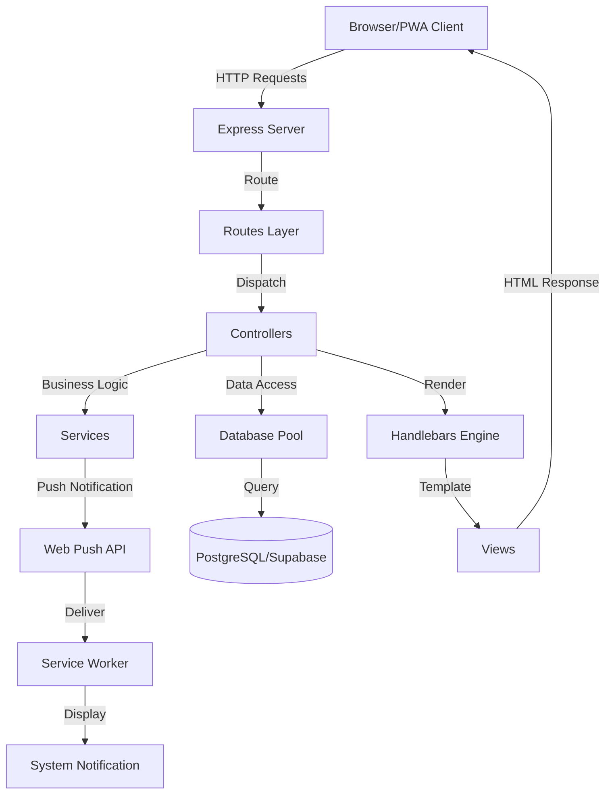

# Padrões do Sistema - PWA Agendamento de Consultas Médicas

**Última Atualização**: 2025-10-21
**Versão**: 2.0

---

## Arquitetura Geral

A arquitetura do sistema segue o padrão **MVC (Model-View-Controller)** com uma camada adicional de **Services** para lógica de negócio complexa.



---

## Camadas da Aplicação

### 1. Camada de Apresentação (Views)

**Responsabilidade**: Renderização de HTML e UI

**Tecnologia**: Handlebars templates

**Estrutura**:
```
views/
├── layouts/
│   └── main.hbs              # Layout principal (header, body, footer)
├── partials/
│   ├── header.hbs            # Cabeçalho com menu de navegação
│   ├── footer.hbs            # Rodapé
│   └── appointment-card.hbs  # Card reutilizável de consulta
├── home.hbs                  # Dashboard
├── login.hbs                 # Login
├── register.hbs              # Registro
├── consultas.hbs             # Lista de consultas
├── nova-consulta.hbs         # Formulário de nova consulta
├── notificacoes.hbs          # Inbox de notificações
└── perfil.hbs                # Perfil do usuário
```

**Padrões**:
- **Layout Pattern**: Um layout principal (main.hbs) reutilizado em todas as páginas
- **Partial Pattern**: Componentes reutilizáveis (header, footer, cards)
- **Server-Side Rendering**: Todo HTML gerado no servidor
- **Data Binding**: Variáveis Handlebars para conteúdo dinâmico

**Exemplo**:
```handlebars
{{!-- views/layouts/main.hbs --}}
<!DOCTYPE html>
<html>
<head>
    <title>{{title}}</title>
    <link rel="stylesheet" href="/css/style.css">
</head>
<body>
    {{> header}}
    {{{body}}}
    {{> footer}}
</body>
</html>
```

---

### 2. Camada de Roteamento (Routes)

**Responsabilidade**: Mapeamento de URLs para controllers

**Tecnologia**: Express Router

**Estrutura**:
```
routes/
├── authRoutes.js           # /login, /register, /logout
├── appointmentRoutes.js    # /consultas/* (protegido)
├── notificationRoutes.js   # /notificacoes/* (protegido)
├── userRoutes.js           # /perfil/* (protegido)
└── testRoutes.js           # /test-* (público)
```

**Padrões**:
- **RESTful Routes**: Verbos HTTP semânticos (GET, POST, PUT, DELETE)
- **Route Grouping**: Rotas relacionadas agrupadas em arquivos
- **Middleware Chain**: Autenticação aplicada em grupo
- **Public vs Protected**: Separação clara de rotas públicas e protegidas

**Exemplo**:
```javascript
// routes/appointmentRoutes.js
const express = require('express');
const router = express.Router();
const appointmentController = require('../controllers/appointmentController');

// Todas essas rotas requerem autenticação (middleware aplicado em server.js)
router.get('/', appointmentController.listAppointments);
router.get('/nova', appointmentController.renderNewAppointmentForm);
router.post('/nova', appointmentController.addAppointment);
router.post('/atualizar-status', appointmentController.updateAppointmentStatus);

module.exports = router;
```

---

### 3. Camada de Controle (Controllers)

**Responsabilidade**: Processar requisições HTTP e coordenar respostas

**Tecnologia**: Express request handlers

**Estrutura**:
```
controllers/
├── authController.js         # Login, registro, logout, sessões
├── appointmentController.js  # CRUD de consultas
├── notificationController.js # Gerenciamento de notificações
└── userController.js         # Perfil, upload de foto
```

**Padrões**:
- **Thin Controllers**: Lógica mínima, delega para services
- **Error Handling**: Try-catch em todas as operações async
- **Input Validation**: Valida dados antes de processar
- **Response Formatting**: Retorna JSON ou renderiza view

**Exemplo**:
```javascript
// controllers/appointmentController.js
exports.addAppointment = async (req, res) => {
    const { doctorName, specialty, appointmentDate, appointmentTime, location } = req.body;
    const userId = req.session.userId;

    try {
        // 1. Validação de input (simplificada)
        if (!doctorName || !specialty || !appointmentDate) {
            return res.status(400).send('Campos obrigatórios faltando');
        }

        // 2. Lógica de persistência
        await pool.query(
            `INSERT INTO appointments (user_id, doctor_name, specialty, appointment_date, appointment_time, location, status)
             VALUES ($1, $2, $3, $4, $5, $6, 'confirmada')`,
            [userId, doctorName, specialty, appointmentDate, appointmentTime, location]
        );

        // 3. Lógica de negócio (delegada para service)
        const formattedDate = new Date(appointmentDate).toLocaleDateString('pt-BR');
        const customMessage = `Sua consulta com ${doctorName} (${specialty}) foi agendada para ${formattedDate} às ${appointmentTime}.`;
        await sendPushNotification(userId, 'Nova Consulta Agendada!', customMessage);

        // 4. Resposta
        res.redirect('/consultas');
    } catch (error) {
        console.error('Error adding appointment:', error);
        res.status(500).send('Erro ao adicionar consulta');
    }
};
```

---

### 4. Camada de Serviço (Services)

**Responsabilidade**: Lógica de negócio complexa e integrações

**Tecnologia**: Classes/módulos JavaScript

**Estrutura**:
```
services/
└── notificationService.js    # Envio de push notifications
```

**Padrões**:
- **Single Responsibility**: Cada service tem um propósito específico
- **Reusability**: Funções podem ser chamadas de múltiplos controllers
- **Business Logic Encapsulation**: Lógica complexa isolada
- **External Integrations**: Comunicação com APIs externas

**Exemplo**:
```javascript
// services/notificationService.js
const webpush = require('web-push');
const pool = require('../config/db');

// Configuração VAPID
webpush.setVapidDetails(
    `mailto:${process.env.VAPID_MAILTO}`,
    process.env.PUBLIC_VAPID_KEY,
    process.env.PRIVATE_VAPID_KEY
);

async function sendPushNotification(userId, title, message) {
    try {
        // 1. Persistir notificação
        await pool.query(
            `INSERT INTO notifications (user_id, title, message, sent_at, lido)
             VALUES ($1, $2, $3, NOW(), FALSE)`,
            [userId, title, message]
        );

        // 2. Buscar subscrições do usuário
        const subscriptionsResult = await pool.query(
            'SELECT * FROM push_subscriptions WHERE user_id = $1',
            [userId]
        );

        // 3. Enviar para cada dispositivo
        const pushPromises = subscriptionsResult.rows.map(async (sub) => {
            const pushSubscription = {
                endpoint: sub.endpoint,
                keys: { p256dh: sub.p256dh, auth: sub.auth }
            };

            const payload = JSON.stringify({
                title: title,
                body: message,
                icon: '/icons/android-launchericon-192-192.png',
                badge: '/icons/android-launchericon-96-96.png',
                data: { url: '/notificacoes' }
            });

            try {
                await webpush.sendNotification(pushSubscription, payload);
            } catch (error) {
                // 4. Limpeza de subscrições expiradas
                if (error.statusCode === 410) {
                    await pool.query('DELETE FROM push_subscriptions WHERE id = $1', [sub.id]);
                }
            }
        });

        await Promise.all(pushPromises);
        return true;
    } catch (error) {
        console.error('Error sending push notification:', error);
        return false;
    }
}

module.exports = { sendPushNotification };
```

---

### 5. Camada de Dados (Database)

**Responsabilidade**: Acesso a dados e persistência

**Tecnologia**: PostgreSQL via pg driver

**Padrões**:
- **Connection Pooling**: Reutilização de conexões
- **Prepared Statements**: Proteção contra SQL injection
- **Foreign Keys**: Integridade referencial
- **Indexes**: Otimização de queries frequentes

**Schema Pattern**:
```sql
-- Tabela principal de usuários
CREATE TABLE users (
    id SERIAL PRIMARY KEY,
    name VARCHAR(255) NOT NULL,
    email VARCHAR(255) UNIQUE NOT NULL,
    password_hash VARCHAR(255) NOT NULL,
    profile_picture_url VARCHAR(500),
    created_at TIMESTAMP DEFAULT CURRENT_TIMESTAMP
);

-- Tabela de consultas (FK para users)
CREATE TABLE appointments (
    id SERIAL PRIMARY KEY,
    user_id INTEGER NOT NULL REFERENCES users(id) ON DELETE CASCADE,
    doctor_name VARCHAR(255) NOT NULL,
    specialty VARCHAR(255) NOT NULL,
    appointment_date DATE NOT NULL,
    appointment_time TIME NOT NULL,
    location VARCHAR(500),
    status VARCHAR(50) DEFAULT 'confirmada'
);

-- Indexes para performance
CREATE INDEX idx_appointments_user_id ON appointments(user_id);
CREATE INDEX idx_appointments_date ON appointments(appointment_date);
```

---

## Padrões de Design Aplicados

### 1. MVC (Model-View-Controller)

**Separação de Responsabilidades**:
- **Model**: Camada de dados (PostgreSQL tables)
- **View**: Templates Handlebars
- **Controller**: Express route handlers

**Benefícios**:
- Código organizado e manutenível
- Fácil de testar cada camada isoladamente
- Mudanças em uma camada não afetam outras

---

### 2. Service Layer Pattern

**Objetivo**: Isolar lógica de negócio complexa dos controllers

**Implementação**:
- `notificationService.js`: Envio de push notifications
- Funções reutilizáveis exportadas como módulos
- Controllers chamam services, não fazem lógica complexa

**Benefícios**:
- Reutilização de código
- Testabilidade
- Separação clara de responsabilidades

---

### 3. Middleware Chain Pattern

**Objetivo**: Aplicar lógica cross-cutting (autenticação, logging) de forma modular

**Implementação**:
```javascript
// server.js
app.use(express.json());
app.use(express.urlencoded({ extended: true }));
app.use(session({ /* config */ }));

// Aplicar autenticação a grupo de rotas
app.use('/consultas', isAuthenticated, appointmentRoutes);
app.use('/notificacoes', isAuthenticated, notificationRoutes);
```

**Benefícios**:
- DRY (Don't Repeat Yourself)
- Fácil adicionar/remover middleware
- Ordem de execução clara

---

### 4. Repository Pattern (Simplificado)

**Objetivo**: Abstrair acesso a dados

**Implementação**: Queries SQL encapsuladas em functions/controllers

```javascript
// Exemplo de abstração de query
async function getUserNotifications(userId) {
    const result = await pool.query(
        'SELECT * FROM notifications WHERE user_id = $1 ORDER BY sent_at DESC',
        [userId]
    );
    return result.rows;
}
```

**Benefícios**:
- Mudanças no schema impactam menos código
- Queries reutilizáveis
- Fácil adicionar caching no futuro

---

## Fluxo de Dados - Arquitetura de Notificações

### Fluxo Completo de Push Notification

```
1. TRIGGER (Criação de Consulta)
   └─> appointmentController.addAppointment()
       │
       ▼
2. SERVICE LAYER
   └─> notificationService.sendPushNotification(userId, title, message)
       │
       ├─> Inserir em notifications table (inbox)
       │
       ├─> Buscar push_subscriptions do usuário
       │
       └─> Para cada subscrição:
           └─> webpush.sendNotification(subscription, payload)
               │
               ▼
3. WEB PUSH API (Google/Mozilla/Apple)
   │
   ▼
4. SERVICE WORKER (Client-side)
   └─> self.addEventListener('push', ...)
       │
       ├─> Extrair dados do evento
       │
       └─> self.registration.showNotification(title, options)
           │
           ▼
5. SYSTEM NOTIFICATION TRAY
   │
   └─> User clicks notification
       │
       ▼
6. SERVICE WORKER (notificationclick event)
   └─> clients.openWindow('/notificacoes')
       │
       ▼
7. NOTIFICATION INBOX PAGE
   └─> Renderiza histórico completo de notificações
```

---

## Padrões de PWA

### 1. App Shell Pattern

**Objetivo**: Carregar UI básica imediatamente, mesmo offline

**Implementação**:
```javascript
// service-worker.js - Install event
const urlsToCache = [
    '/',
    '/css/style.css',
    '/js/app.js',
    '/manifest.json',
    '/icons/android-launchericon-192-192.png'
];

self.addEventListener('install', (event) => {
    event.waitUntil(
        caches.open(CACHE_NAME)
            .then((cache) => cache.addAll(urlsToCache))
    );
});
```

**Benefícios**:
- Carregamento instantâneo em visitas subsequentes
- Funciona offline
- Melhor experiência de usuário

---

### 2. Cache-First / Network-First Strategy

**Objetivo**: Balancear performance e freshness de dados

**Implementação**:
```javascript
// Cache-first para assets estáticos
if (request.destination === 'style' || request.destination === 'script') {
    return caches.match(request).then(cached => {
        return cached || fetch(request);
    });
}

// Network-first para navegação
if (request.mode === 'navigate') {
    return fetch(request).catch(() => {
        return caches.match(request);
    });
}
```

**Benefícios**:
- Assets estáticos carregam instantaneamente (cache-first)
- Navegação sempre atualizada quando online (network-first)
- Fallback offline para ambos

---

### 3. Background Sync Pattern (Preparado)

**Objetivo**: Sincronizar dados quando conexão retornar

**Status**: Arquitetura preparada, não implementado

**Exemplo Futuro**:
```javascript
// Registrar sync quando offline
if ('serviceWorker' in navigator && 'sync' in self.registration) {
    self.registration.sync.register('sync-appointments');
}

// Service worker
self.addEventListener('sync', (event) => {
    if (event.tag === 'sync-appointments') {
        event.waitUntil(syncAppointments());
    }
});
```

---

## Padrões de Segurança

### 1. Session-Based Authentication Pattern

**Implementação**:
```javascript
// server.js
app.use(session({
    secret: process.env.SESSION_SECRET,
    resave: false,
    saveUninitialized: false,
    cookie: {
        secure: false, // true em produção com HTTPS
        maxAge: 24 * 60 * 60 * 1000 // 24 horas
    }
}));

// Middleware de autenticação
function isAuthenticated(req, res, next) {
    if (req.session && req.session.userId) {
        return next();
    }
    res.redirect('/login');
}
```

**Benefícios**:
- Controle server-side de sessões
- Fácil invalidar sessões
- Adequado para SSR (Server-Side Rendering)

---

### 2. Password Hashing Pattern

**Implementação**:
```javascript
const bcrypt = require('bcrypt');

// Registro
const hashedPassword = await bcrypt.hash(password, 10);
await pool.query(
    'INSERT INTO users (name, email, password_hash) VALUES ($1, $2, $3)',
    [name, email, hashedPassword]
);

// Login
const user = await pool.query('SELECT * FROM users WHERE email = $1', [email]);
const match = await bcrypt.compare(password, user.rows[0].password_hash);
```

**Benefícios**:
- Senhas nunca armazenadas em plaintext
- Hash one-way (não reversível)
- Salt automático (proteção contra rainbow tables)

---

### 3. Prepared Statements Pattern

**Implementação**:
```javascript
// CORRETO - Prepared statement (proteção contra SQL injection)
await pool.query(
    'SELECT * FROM appointments WHERE user_id = $1',
    [userId]
);

// INCORRETO - String concatenation (vulnerável)
await pool.query(`SELECT * FROM appointments WHERE user_id = ${userId}`);
```

**Benefícios**:
- Proteção contra SQL injection
- Performance (query plan cacheado)
- Type safety

---

## Padrões de Código

### 1. Error Handling Pattern

**Try-Catch em Async Functions**:
```javascript
exports.someController = async (req, res) => {
    try {
        // Operações assíncronas
        const result = await someAsyncOperation();
        res.json(result);
    } catch (error) {
        console.error('Error in someController:', error);
        res.status(500).json({ error: 'Internal server error' });
    }
};
```

---

### 2. Environment Variables Pattern

**Configuração Centralizada**:
```javascript
require('dotenv').config();

const config = {
    port: process.env.PORT || 3000,
    database: {
        host: process.env.DB_HOST,
        port: process.env.DB_PORT,
        // ...
    },
    session: {
        secret: process.env.SESSION_SECRET
    },
    vapid: {
        publicKey: process.env.PUBLIC_VAPID_KEY,
        privateKey: process.env.PRIVATE_VAPID_KEY,
        mailto: process.env.VAPID_MAILTO
    }
};
```

**Benefícios**:
- Configuração separada do código
- Fácil mudar entre ambientes (dev, staging, prod)
- Segurança (secrets não commitados)

---

### 3. Modular Exports Pattern

**Organização de Módulos**:
```javascript
// services/notificationService.js
async function sendPushNotification(userId, title, message) { /* ... */ }
async function getNotifications(userId) { /* ... */ }

module.exports = {
    sendPushNotification,
    getNotifications
};

// Uso em controller
const { sendPushNotification } = require('../services/notificationService');
```

---

## Fluxo de Autenticação

```
1. USER REQUEST
   └─> GET /consultas
       │
       ▼
2. MIDDLEWARE CHAIN
   └─> isAuthenticated middleware
       │
       ├─> Session exists? ──YES──> next()
       │                              │
       │                              ▼
       │                      appointmentController.listAppointments()
       │                              │
       │                              ▼
       │                      Render consultas.hbs
       │
       └─> NO ──> res.redirect('/login')
                       │
                       ▼
                  Render login.hbs
                       │
                       ▼
                  User submits credentials
                       │
                       ▼
                  authController.login()
                       │
                       ├─> Validate credentials
                       ├─> Create session
                       └─> Redirect to original URL
```

---

## Convenções de Nomenclatura

### Arquivos
- **Controllers**: `*Controller.js` (camelCase)
- **Routes**: `*Routes.js` (camelCase)
- **Services**: `*Service.js` (camelCase)
- **Views**: `*.hbs` (kebab-case para URLs)

### Funções
- **Controllers**: `verbNoun()` - ex: `addAppointment()`, `listAppointments()`
- **Services**: `verbNoun()` - ex: `sendPushNotification()`
- **Middleware**: `isState()` - ex: `isAuthenticated()`

### Variáveis
- **camelCase**: Para variáveis JavaScript
- **UPPER_SNAKE_CASE**: Para constantes e env vars
- **snake_case**: Para nomes de colunas no database

---

## Conclusão

A arquitetura do sistema segue padrões consolidados da indústria (MVC, Service Layer, Middleware Chain) com adaptações específicas para PWA (App Shell, Cache Strategies, Push Notifications). A separação clara de responsabilidades facilita manutenção, testes e evolução do código.

**Princípios Seguidos**:
- Separation of Concerns
- Don't Repeat Yourself (DRY)
- Single Responsibility Principle
- Keep It Simple, Stupid (KISS)

**Última Revisão**: 2025-10-21
**Versão**: 2.0
**Mantido por**: Claude Code (Anthropic)
